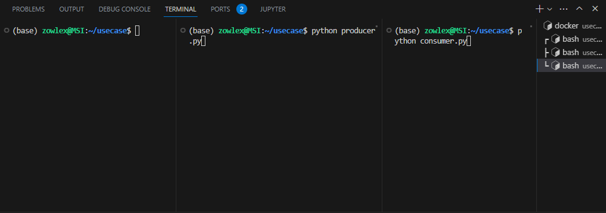
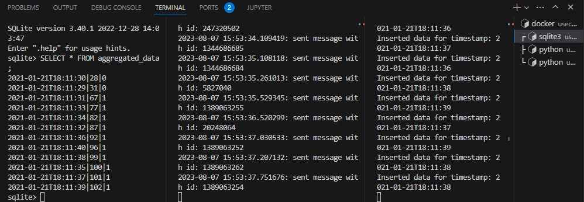

# Data Transformation & Analysis Challenge


## Beschreibung des Use Cases

Unser Kunde, ein Medienhaus, ist interessiert an aktuellen Trends auf Wikipedia und historischen Veränderungen von Themen. Dafür sollen perspektivisch alle vorgenommenen Änderungen der Wikipedia gespeichert, verarbeitet und Ergebnisse in einem Dashboard dargestellt werden. Um dieses Ziel zu erreichen, haben wir ein System entwickelt, das Änderungs-Events von Wikipedia mithilfe von RabbitMQ bereitstellt und in einer Datenbank speichert, um Analysen durchzuführen.

## Lösung

Die Lösung besteht aus zwei Hauptkomponenten: einem Producer und einem Consumer.

### Producer

Der Producer liest Beispieldaten aus einer CSV-Datei (`assets/dataset.csv`) und sendet diese Daten mit Hilfe von RabbitMQ in zufälligen Abständen an einen passenden Exchange. Dies ermöglicht das Emittieren von Änderungsereignissen in die Messaging-Warteschlange.

#### Auswahl des Datenmodells:

Für das Datenmodell habe ich das folgende Datenmodell benutzt, wo nach der Verarbeitung der Events die Zeit der Speicherung der Daten, die globale Events und deutsche Events gespeichert werden. Dies ermöglicht später eine flexible Datenverarbeitung und weitere Aggregationsmöglichkeiten für die Darstellung auf das Dashboard.

```
timestamp TEXT PRIMARY KEY
global_edits INTEGER
german_edits INTEGER
```

#### Auswahl des passenden Exchanges:
Für die dargestellte Lösung habe ich ein Exchange von Typ **Fanout** in Betracht auf das Pub/sub Muster und folgenden Vor-/Nachteile ausgewählt.

(+) Vorteile:
- **Daten Verteilung**: Mehrere Datenverbraucher können Daten in Nah-Echtzeit abfragen, wo jeder die Daten anhand des Bedarfs verarbeiten kann. Zum Beispiel, einige interessieren sich nur für Daten von deutschen Wikis, andere für englische, usw.

- **Entkoplung**: Datenproduzenten und Datenverbracher müssen nicht in Kontakt kommen und dies ist für unser Szenario (was mit einem Opensource Projekt verbunden ist) nützlich, weil Datenveränderungen täglich von verschiedenen Nutzern erledigt werden.

- **Einfache Konfiguration**: Fanout erfordert keine komplexe Routing-Logik und dies ermöglicht später die simple Skalierbarkeit des Systems, wo den Consumers-code unverändert bleiben kann.

(-) Nachteile:

- **Begrenzte Selektivität**: Da die Nachrichten an alle Warteschlangen gesendet werden, besteht die Möglichkeit, dass Empfänger irrelevante Nachrichten erhalten. Und das hängt auch Stark vom ausgewählten Datenmodell.

- **Resourcenintensiv**: Da Daten an alle Queues gesendet werden, bedeut dass, die Ressourcen einer Instanz (Speicher, CPU) schnell belastet werden könnten.

### Consumer

Der Consumer verarbeitet die empfangenen Änderungs-Events aus der Warteschlange. Er führt Aggregationen durch, wie die globale Anzahl der Edits pro Minute und die Anzahl der Edits der deutschen Wikipedia pro Minute. Die aggregierten Daten werden in einer SQLite-Datenbank gespeichert.

#### Auswahl der Datenbank
Ich habe eine SQL basierte Datenbank für die vorgeschlagene Lösung ausgewählt, hauptsächtlich wegen der Struktur der Daten, die strukturiert sind und können mühungslos in einer SQLite Datnbank gespeichert werden. Allerdings wäre eine Zeitreihendatenbank wie InfluxDB eine bessere Lösung, Falls größere Datensätze benutzt werden müssen und Nah-Echtzeit Verarbeitung ist erfordert.

(+) Vorteile von SQLite:

- Einfachheit: SQLite ist eine eingebettete Datenbank, die kein searat Serverinstallation erfordert.
- Portabilität: Die Datenbank Datei kann problemlos zwischen Systemen verschoben werden.
- Geeignet für kleinere Datensätze

(-) Nachteile:

- Skalirbarkeit: SQLite bietet keine verteilte Architektur, daher bei großen Datenmengen kann begrenzt werden

- Knkurrenz-Konflikte: Da SQLite sich auf einer Datei basiert, kann zur Konflikten von Prozessen führen.

## Verwendung

> **Voraussetzungen:**
Vor der Verwendung ist eine passende Python Umgebung nötig, um gleiche Ergebnisse zu reproduzieren.
>1. Pythonversion: 3.10.9
>2. Umgebung: benutzte Packages sind in der Datei **requirements.txt** zu sehen, und mit der eine env erstellt werden soll.

1. Starten Sie den RabbitMQ-Server mithilfe von Docker und Docker Compose:

    ```
    docker-compose up
    ```

2. Führen Sie den Producer-Code aus, um Beispieldaten an den RabbitMQ-Exchange zu senden:
    ```
    python consumer.py
    ```
3. Starten Sie den Consumer-Code, um die empfangenen Änderungs-Events zu verarbeiten und in der Datenbank zu speichern:

    ```
    python producer.py
    ```
4. Überprüfen Sie die aggregierten Daten in der SQLite-Datenbank 

    ```
    sqlite3 db/wiki_stats.db
    sqlite> SELECT * FROM aggregated_data;
    ```


SQLite | Producer | Consumer
